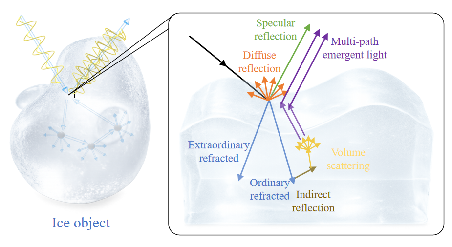

<div align="center">

# IceSfP: Structure-Aware Consistency Priors for Shape from Polarization in Complex Media

**ICML 2026**

[](https://proceedings.mlr.press)
[](LICENSE)
[](https://www.python.org)
[](https://pytorch.org)

**Kaimin Yu**, **Puyun Wang**, **Huayang He**, **Xianyu Wu**†

School of Mechanical Engineering and Automation, Fuzhou University  
Research Institute of Highway, Ministry of Transport, Beijing


---


## Overview

Recovering surface normals from single-view polarization images in **complex media** remains a fundamental challenge in computer vision. This work focuses on **ice** — a representative complex medium — where intricate light–matter interactions (birefringence, multiple scattering, anisotropic propagation) corrupt polarization measurements, breaking the assumptions of classical Shape from Polarization (SfP) methods.

We propose a **structure-aware polarization consistency prior** based on autocorrelation functions to capture local spatial coherence in AoLP, and design a **dual-branch network (IceSfP)** that integrates raw polarization features with physics-based priors via cross-modal attention and multi-scale feature fusion. We also introduce the **first real-world ice SfP dataset**, providing a benchmark for this challenging scenario.

> The key idea: Not all polarization signals are equally reliable in complex media. By quantifying where AoLP shows strong spatial autocorrelation, we can guide the network toward structurally coherent regions and suppress unreliable cues from volumetric scattering.

---

## Key Contributions

1. **Structure-Aware Polarization Consistency Prior** — Constructed from AoLP autocorrelations, combined with a Cross-modal Reliability Attention (CRA) module to selectively weight physics-based normal priors under ambiguous polarization signals.

2. **IceSfP Network** — A dual-branch architecture that adaptively fuses raw polarization observations with physics-based priors, achieving robust surface normal estimation in complex media.

3. **First Ice SfP Dataset** — The first real-world dataset providing ground-truth surface normals and polarization observations for ice objects, enabling benchmarking of learning-based SfP methods in complex media.

---

## Method

### Overall Architecture

The IceSfP network adopts a dual-branch design:

| Component | Description |
|-----------|-------------|
| **Raw Polarization Branch** | Takes 4-channel polarization images (0°, 45°, 90°, 135°) as input, uses EPSANet50 backbone with ASPP for multi-scale feature extraction |
| **Physics Prior Branch** | Encodes candidate normal maps from Fresnel model, concatenated with the structure-aware consistency prior |
| **CRA Module** | Cross-modal attention at the deepest feature scale to selectively enhance reliable physics-based priors |
| **Multi-scale Feature Fusion** | Integrates features from both branches at multiple resolutions via skip connections |
| **SPADE-augmented Decoder** | Spatially-adaptive normalization preserves local spatial details from polarization images |

### Polarization Consistency Prior

The consistency prior quantifies local spatial coherence of the Angle of Linear Polarization (AoLP) using:

1. **Autocorrelation Function (ACF)** — Measures spatial consistency of AoLP within local neighborhoods using a DoLP-weighted double-angle vector representation
2. **Stationary Wavelet Transform (SWT)** — Captures directional structural discontinuities and complex textures at multiple scales
3. **Consistency Map** — Combines normalized correlation decay scale and high-frequency energy to produce a pixel-wise reliability map

This prior guides the network toward regions where polarization signals are structurally coherent, enabling robust learning in complex media.

---

## Dataset: IceSfP

We constructed the **first real-world SfP dataset for ice media**:


- High-precision ground-truth normals (0.1mm accuracy via structured-light 3D scanner)
- Polarization images captured at **2448 × 2048** resolution using FLIR polarization camera
- Ice samples fabricated via slow freezing in silicone molds to preserve realistic scattering effects

---

## Results

### Quantitative Comparison on IceSfP Dataset

| Method | MAE ↓ | MedAE ↓ | < 11.25° ↑ | < 22.5° ↑ | < 30° ↑ |
|--------|-------|---------|-----------|-----------|---------|
| **Ours** | **16.01°** | **13.93°** | **41.92%** | **79.58%** | **89.21%** |
| DeepSfP | 18.76° | 16.32° | 34.35% | 70.65% | 82.80% |
| TransSfP | 18.75° | 16.48° | 32.13% | 73.26% | 85.01% |
| Attention U2-Net | 19.59° | 17.62° | 29.67% | 71.17% | 83.83% |
| SPW | 20.13° | 18.34° | 25.29% | 67.27% | 82.95% |
| Mahmoud et al. | 62.32° | 60.09° | 0.54% | 2.75% | 4.91% |

> Our method achieves a **MAE of 16.01°**, outperforming the second-best method by **2.74°** — a significant margin in surface normal estimation.


---

## Installation

```bash
# Clone the repository
git clone https://github.com/your-username/IceSfP
cd IceSfP

# Create conda environment
conda create -n icesfp python=3.8
conda activate icesfp

# Install dependencies
pip install -r requirements.txt
```

## Quick Start

```python
# Coming soon — training and inference scripts will be released upon publication
```

---

## Citation

If you find this work useful for your research, please cite:

```bibtex
@inproceedings{yu2026icesfp,
  title     = {Structure-Aware Consistency Priors for Shape from Polarization in Complex Media},
  author    = {Yu, Kaimin and Wang, Puyun and He, Huayang and Wu, Xianyu},
  booktitle = {Proceedings of the 43rd International Conference on Machine Learning (ICML)},
  year      = {xxxx},
  address   = {xxx}
}
```


---

## Acknowledgments

This work was supported by Fuzhou University and the Research Institute of Highway, Ministry of Transport, Beijing.

---

<div align="center">
  <sub>Made with ♥ by the IceSfP Team</sub>
</div>
